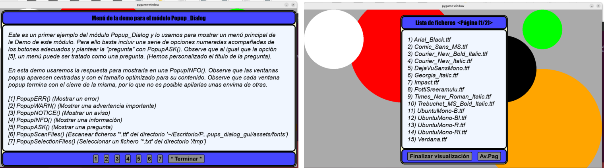

# Tutorial popups_dialog_gui

## Requisitos
- Python 3 y `pygame`.

## Cómo ejecutar las demos
- Desde el lanzador del proyecto (recomendado): selecciona la demo en la lista.
- Ejecución directa: `python3 <demo>.py` (desde el entorno del proyecto).

## Estructura del tutorial
- Cada sección corresponde a una demo y describe:
  - qué se aprende,
  - qué API se utiliza,
  - y qué resultado debe observarse.

En este tutorial se presentan demos que ilustran distintos aspectos de `popups_dialog_gui`.

Antes que nada recomendamos echar un vistazo al documento **Visión general (ES)**: [OVERVIEW_es.md](OVERVIEW_es.md)

Empezaremos con una demo extremadamente simple, pensada para validar el funcionamiento más básico del proyecto.

Después seguiremos con una demo que aglutina, en sí misma, demostraciones de las funcionalidades más habituales.

Las demos restantes se dedican a ilustrar el uso de `SurfacePPsct` y la inserción de superficies dinámicas, porque su uso
es menos trivial y menos intuitivo. Solo se utiliza cuando queremos incluir dentro de la popup un contenido dinámico.

Incluso sería posible embutir una aplicación completa dentro de un popup; la conveniencia de hacerlo exige valorar pros y contras.
En general, complicaría el código, aunque puede aportar ventajas.

Muchos de los beneficios de `popups_dialog_gui` se pueden obtener con un uso simple, sin necesidad de contenido dinámico.

## Índice de demos
- [1.1) demo_simple.py](#11-demo_simplepy)
- [1.2) demo_Popup_Dialog.py](#12-demo_popup_dialogpy)
- [2.1) demo_Popup_Surface.py](#21-demo_popup_surfacepy)
- [2.2) demo_Popup_Surface_ColorCycle.py](#22-demo_popup_surface_colorcyclepy)
- [2.3) demo_Popup_Surface_Selector.py](#23-demo_popup_surface_selectorpy)
- [2.4) demo_rebota_controles.py](#24-demo_rebota_controlespy)

---

## 1.1) demo_simple.py

### Qué aprenderás en esta demo:

1. Inicialización mínima del sistema de popups sobre una ventana Pygame:
  - Se crea la ventana principal (pygame.display.set_mode) y se pasa a IniPopupDialog().
2. Uso de estilos (Style_ID) como primer parámetro de personalización:
  - El usuario elige entre 'playful_childlike' y 'formal', y ese identificador se aplica al módulo.
3. Uso de una función de alto nivel lista para producción:
  - PopupNOTICE() muestra un diálogo modal con un único botón, sin necesidad de construir clases/secciones.
4. Contexto visual:
  - Se dibuja un fondo (círculos) para comprobar que el popup se superpone correctamente al render principal.

### API utilizada (núcleo):
- IniPopupDialog(Display, Style_ID)
- PopupNOTICE(Message, IdButt=...)

### Resultado observable:
- Tras elegir estilo, verás la escena dibujada y luego un popup NOTICE con el estilo seleccionado y un botón "Finalizar".

---

## 1.2) demo_Popup_Dialog.py

Al igual que la demo anterior (1.1) empezamos ofreciendo elegir desde el terminal el tipo de estilo.
En la imagen podemos ver como usa una PopupASK() como menú general para elegir lanzar pequeñas demos muy simples, y también el aspecto de una de esas demos que muestra el contenido de nuestro directorio de fuentes.

### Qué aprenderás en esta demo:
1. Cómo usar PopupASK() para implementar menús y flujos de decisión:
  - Un menú no deja de ser una “pregunta” con opciones; el retorno se usa como selector de comportamiento.
2. Diferencias prácticas entre los popups de alto nivel:
  - PopupERR/PopupWARN/PopupNOTICE/PopupINFO muestran variantes visuales para tipos de mensajes diferentes.
3. Ciclo de interacción basado en un bucle de aplicación:
  - Un while True externo que dispara popups secuencialmente, evitando “apilado” de ventanas (modelo modal).
4. Preparación de datos para una demo realista:
  - Generación de un conjunto de ficheros en /tmp para probar paginación/selección con volumen de elementos.
5. Escaneo y selección de ficheros con UI integrada:
  - PopupScanFiles() recorre un directorio y filtra por extensión (ej. fuentes .ttf).
  - PopupSelectionFiles() permite elegir un fichero y devuelve una ruta/nombre para uso posterior.
6. Manejo de rutas “amigables” para UI sin romper la lógica interna:
  - Se mantiene el path absoluto para operar (PathFonts), y se presenta una versión abreviada para textos del menú.
7. Integración con el localizador de assets del proyecto:
  - resolve_asset_layout() centraliza dónde están recursos como fonts_dir y evita hardcode de rutas.

### API utilizada (núcleo):
- IniPopupDialog(Display, Style_ID)
- PopupASK(Message, Buttons, Title=...)
- PopupERR(Message), PopupWARN(Message), PopupNOTICE(Message), PopupINFO(Message)
- PopupScanFiles(dir=..., extension=...)
- PopupSelectionFiles(dir=..., extension=...)
- resolve_asset_layout()  (fonts_dir)

### Resultado observable:
- Desde el menú principal podemos lanzar distintos tipos de popups. Las dos últimas son demos de ficheros:
  (i) escaneo de .ttf en el directorio de fuentes del proyecto y (ii) selección de .txt en /tmp con muchos elementos.
- En la opción de selección, se observa el caso de cancelación (ret == '') y el caso de retorno con ruta/archivo.

---

## 2.1) demo_Popup_Surface.py

### Qué aprenderás en esta demo:

1. Cómo insertar contenido gráfico (una `pygame.Surface`) como “kernel” central de una `PopupDialogWindow`:
  - En lugar de texto (`MessagePPsct`), el contenido principal es una superficie dibujada por el usuario.
2. Relación conceptual con `SurfacePPsct`:
  - El objetivo es entender que existe una sección central pensada para mostrar superficies (y, en demos posteriores, contenidos interactivos).
3. Construcción de superficies reutilizables:
  - Se genera una surface parametrizable por tamaño y título, combinando fondo, figuras y texto renderizado.
4. Comprobación de auto-dimensionado y presentación con tamaños variados:
  - Se muestran tres popups con superficies de dimensiones muy diferentes para observar el comportamiento de layout.

### API utilizada (núcleo):
- IniPopupDialog(Display, Style_ID)
- PopupDialogWindow(KernelContent, ListIdButt, Title=..., FlagAlert=...)
- PopupDialogWindow.Run()

### Resultado observable:
- Se mostrarán tres popups consecutivos (cada uno con botón “Salir”), donde el área central contiene una imagen generada
  con un rótulo que indica el título y el tamaño (p.ej. “Imagen 01 (700x200)”).

---

## 2.2) demo_Popup_Surface_ColorCycle.py

### Qué aprenderás en esta demo:

1. Cómo incrustar contenido “dinámico” dentro del área central del popup usando `SurfacePPsct`:
   - En lugar de pasar una `pygame.Surface` estática, se pasa un objeto que implementa el ciclo de vida de `InteractiveContent`.
2. Cómo usar un *stub* como “adaptador” de comportamiento para prototipar contenido dinámico:
   - Aquí *stub* no se usa con el sentido clásico de pruebas unitarias, sino como un componente **deliberadamente simple** que encapsula
     un comportamiento visual (ciclo de color) para poder integrarlo rápidamente en el popup.
   - Este patrón es clave porque te permite:
     - validar el **pipeline** de integración (montaje → render por frame → desmontaje) sin añadir complejidad de dominio,
     - aislar la lógica del contenido (qué se dibuja) del contenedor (cómo se presenta y se interactúa con el popup),
     - iterar sobre nuevos “widgets” cambiando solo este componente, manteniendo el resto del popup igual.
   - En la práctica, el stub define tres ganchos de ciclo de vida:
     - `on_mount(rect)`: prepara recursos en función del tamaño asignado,
     - `draw(surface, rect)`: dibuja el estado en cada frame,
     - `on_unmount()`: libera/limpia recursos al cerrar.
3. Tamaño fijo para contenido interactivo y control de clipping:
   - `interactive_size=(600, 350)` fuerza un tamaño consistente para el “kernel” interactivo, útil para validar recortes (clipping) y layout.
4. Separación clara de responsabilidades:
   - La demo define un “widget” (`ColorCycle`) centrado en dibujar, mientras que el popup (`PopupDialogWindow`) gestiona marco, título y botones.

### API utilizada (núcleo):
- `IniPopupDialog(Display, Style_ID)`
- `InteractiveContent` (métodos: `on_mount()`, `draw()`, `on_unmount()`)
- `SurfacePPsct(content, ..., interactive_size=...)`
- `PopupDialogWindow(kernel_section, ListIdButt, Title=..., FlagAlert=...)`
- `PopupDialogWindow.Run()`

### Resultado observable:
- Se abre un popup con estilo `playful_childlike` que contiene, en su zona central, un rectángulo coloreado en función del tiempo
  y un texto centrado con la etiqueta “ColorCycle (Paso 2)”. El popup se cierra con el botón “Cerrar”.

---

## demo_Popup_Surface_Selector.py

### Qué aprenderás en esta demo:

1. Cómo construir un selector navegable sobre una colección de superficies (`pygame.Surface`) usando popups:
   - Se parte de una lista base de tamaños y títulos y se transforma en una lista de pares `(surface, ident)` reutilizable.
2. Cómo implementar navegación “Anterior / Posterior” como flujo modal repetido:
   - Un bucle mantiene el índice actual y vuelve a abrir el popup con el elemento correspondiente, ocultando botones cuando procede
     (inicio/fin de la lista).
3. Cómo parametrizar botones y resolver de forma uniforme el retorno del popup:
   - Se define `labels` dinámicamente y se traduce la respuesta de `PopupDialogWindow.Run()` a una etiqueta de botón mediante
     `resolve_button_label()`, soportando retornos como `str`, `int` o `dict`.
4. Cómo usar el título del popup como “identificador” del elemento mostrado:
   - Cada surface se acompaña de una cadena `ident` que se muestra como `Title` y que, al seleccionar, se devuelve como resultado final.
5. Patrón de salida de una demo con confirmación visual:
   - Tras seleccionar o cancelar, se pinta el resultado en la ventana principal durante un intervalo y se termina.

### API utilizada (núcleo):
- `IniPopupDialog(Display, Style_ID)`
- `PopupDialogWindow(KernelContent, ListIdButt, Title=..., FlagAlert=...)`
- `PopupDialogWindow.Run()`

### Resultado observable:
- Se abre un popup que muestra una “imagen” (surface) y ofrece botones para navegar por varias superficies.
- Si se pulsa “Seleccionar”, la demo cierra el flujo y muestra en la ventana principal el identificador elegido.
- Si se pulsa “Cancelar” (o se cierra sin elección), la demo indica “Selección cancelada.” y termina.

---

## 2.3) demo_Popup_Surface_Selector.py

### Qué aprenderás en esta demo:

1. Cómo construir un selector navegable sobre una colección de superficies (`pygame.Surface`) usando popups:
   - Se parte de una lista base de tamaños y títulos y se transforma en una lista de pares `(surface, ident)` reutilizable.
2. Cómo implementar navegación “Anterior / Posterior” como flujo modal repetido:
   - Un bucle mantiene el índice actual y vuelve a abrir el popup con el elemento correspondiente, ocultando botones cuando procede
     (inicio/fin de la lista).
3. Cómo parametrizar botones y resolver de forma uniforme el retorno del popup:
   - Se define `labels` dinámicamente y se traduce la respuesta de `PopupDialogWindow.Run()` a una etiqueta de botón mediante
     `resolve_button_label()`, soportando retornos como `str`, `int` o `dict`.
4. Cómo usar el título del popup como “identificador” del elemento mostrado:
   - Cada surface se acompaña de una cadena `ident` que se muestra como `Title` y que, al seleccionar, se devuelve como resultado final.
5. Patrón de salida de una demo con confirmación visual:
   - Tras seleccionar o cancelar, se pinta el resultado en la ventana principal durante un intervalo y se termina.

### API utilizada (núcleo):
- `IniPopupDialog(Display, Style_ID)`
- `PopupDialogWindow(KernelContent, ListIdButt, Title=..., FlagAlert=...)`
- `PopupDialogWindow.Run()`

### Resultado observable:
- Se abre un popup que muestra una “imagen” (surface) y ofrece botones para navegar por varias superficies.
- Si se pulsa “Seleccionar”, la demo cierra el flujo y muestra en la ventana principal el identificador elegido.
- Si se pulsa “Cancelar” (o se cierra sin elección), la demo indica “Selección cancelada.” y termina.

---

## 2.4) demo_rebota_controles.py

### Qué aprenderás en esta demo:

1. Cómo integrar un contenido interactivo no bloqueante dentro de un popup mediante `SurfacePPsct` y `PopupDialogWindow.step()`:
   - En lugar de usar `Run()` (modal/bloqueante), la demo mantiene un bucle propio que llama a `popup.step(events, dt_ms)` para procesar eventos,
     actualizar la simulación y dibujar en cada frame.
2. Manejo unificado de teclado, rueda y ratón dentro del “kernel” interactivo:
   - El contenido (`BouncingParticles`) declara `wants_keyboard()` y `wants_wheel()` para recibir esos eventos, y define `handle_event()` para:
     - LMB: crear una “explosión” de partículas en el punto del clic.
     - RMB: borrar un bloque de partículas.
     - Rueda: escalar la velocidad global (afectando también a las partículas ya existentes).
     - Espacio: pausar/reanudar.
     - Tecla 'c': alternar tamaño de partícula.
3. Uso de coordenadas relativas dentro del área útil del kernel:
   - El contenido trabaja siempre en coordenadas (0..w, 0..h) relativas al rectángulo del kernel; al dibujar se aplica el offset del `rect`.
   - Esto garantiza que el punto del clic (remapeado por `SurfacePPsct`) coincida exactamente con la simulación.
4. Separación entre simulación y presentación:
   - `update(dt_ms)` avanza la física (rebote contra límites) y `draw(surface, rect)` renderiza dentro del rectángulo asignado, con clipping.
5. Integración de ayuda contextual en Markdown sin abandonar la demo:
   - El popup ofrece un botón “Ayuda” que muestra `PopupHELP(HELP_MD, ...)`, pausando la simulación con `popup.pause()` y reanudándola con
     `popup.resume()`. Se descarta además el tiempo acumulado con `clock.tick(30)` para evitar un salto brusco de `dt_ms` al volver.

### API utilizada (núcleo):
- `IniPopupDialog(Display, Style_ID)`
- `InteractiveContent` (métodos: `wants_keyboard()`, `wants_wheel()`, `handle_event()`, `update()`, `draw()`)
- `SurfacePPsct(content, interactive_size=...)`
- `PopupDialogWindow(kernel_section, ListIdButt, Title=..., FlagAlert=...)`
- `PopupDialogWindow.step(events, dt_ms)`, `pause()`, `resume()`
- `PopupHELP(md_text, Title=..., FlagAlert=..., interactive_size=..., style_variant=..., ...)`

### Resultado observable:
- Se abre un popup con un área grande donde partículas rebotan continuamente.
- Con el ratón y el teclado puedes añadir/eliminar partículas, cambiar su tamaño, ajustar velocidad y pausar la simulación.
- El botón “Ayuda” abre un visor con instrucciones en Markdown y, al cerrarlo, la simulación continúa sin “saltos” de tiempo.
